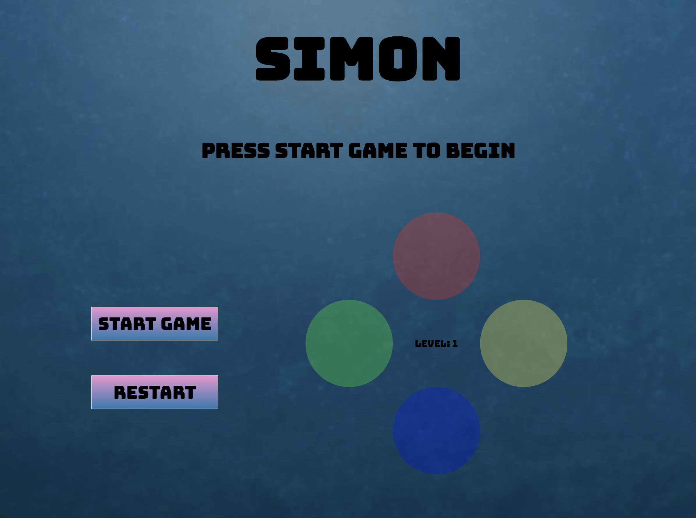

# Simon-Game-Project
Simon-Game link to the live page: 
https://rendonels.github.io/Simon-Game-Project/

Description:
 This project is a recreation of the game Simon, where the computer generates a random assortment of colors and indicates them on screen one at a time.  The player must match that specific sequence of colors by clicking the circles.  If the player matches the sequence, the level progresses and more colors are added at random.

Brief Example
 
 

Future Plans:
1. Add timer for player's
2. Add option to speed up the color displays
3. Add option to increase number of colors
4. Add ability to select colors with arrow keys or "w" "a" "s" "d" "f" 

List of Technologies Used
HTML5, PUG, SCSS, CSS3, "Vanilla" Javascript

Getting Started:

User clicks on "Start Game", the computer generates a random assortment of colors. The user matches the color pattern by clicking on the colors. If they get the pattern right, the game will advance to the next level. If the user gets the pattern wrong a message saying "try again" will appear.

Project's main repository:
https://github.com/RendonEls/Simon-Game-Project

Project's issue tracker:
https://github.com/RendonEls/Simon-Game-Project/issues
